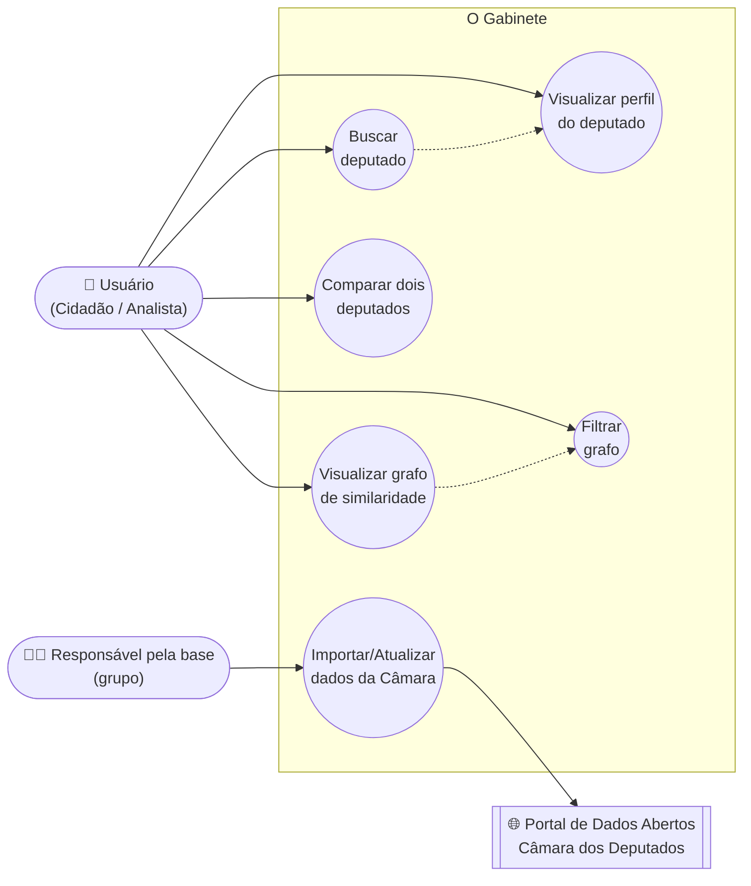
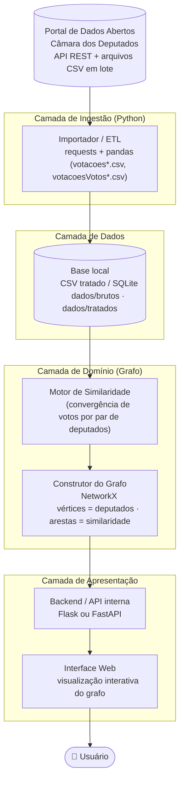

# O Gabinete — Mapa de Similaridade Política entre Deputados Federais

> **TG1 – Definição do Produto de Software**
> Laboratório de Engenharia de Software — Universidade Presbiteriana Mackenzie

---

## Capa

| | |
|---|---|
| **Universidade** | Universidade Presbiteriana Mackenzie — Faculdade de Computação e Informática |
| **Disciplina** | Laboratório de Engenharia de Software — Turma 6º D |
| **Professor** | Gustavo Moreira Calixto |
| **Projeto** | O Gabinete — Mapa de Similaridade Política entre Deputados Federais |
| **Grupo** | Caio Ariel Cardoso Saraiva (RA 10439611) · Isabela Hissa Pinto (RA 10441873) · Kaique Barros Paiva (RA 10441787) |
| **Repositório** | [github.com/hissapinto/O_Gabinete](https://github.com/hissapinto/O_Gabinete) |
| **Entrega** | TG1 |

---

## Sumário

1. [Introdução](#capítulo-1--introdução)
2. [Definição da Demanda](#capítulo-2--definição-da-demanda)
   - 2.1 [O problema ou oportunidade percebida](#21-o-problema-ou-oportunidade-percebida)
   - 2.2 [A razão ou justificativa para esta demanda](#22-a-razão-ou-justificativa-para-esta-demanda)
   - 2.3 [Descrição sucinta do produto de software](#23-descrição-sucinta-do-produto-de-software)
   - 2.4 [Clientes, usuários e demais envolvidos](#24-clientes-usuários-e-demais-envolvidosimpactados)
   - 2.5 [Principais etapas para construir o produto](#25-principais-etapas-necessárias-para-construir-o-produto)
   - 2.6 [Principais critérios de qualidade](#26-principais-critérios-de-qualidade-para-o-produto)
3. [Requisitos](#capítulo-3--requisitos)
4. [Wireframes](#capítulo-4--wireframes)
5. [Modelagem Leve do Sistema (Casos de Uso)](#capítulo-5--modelagem-leve-do-sistema-casos-de-uso)
6. [Arquitetura do Sistema](#capítulo-6--arquitetura-do-sistema)

> **Nota de escopo:** o projeto foi originalmente proposto na disciplina de Teoria dos Grafos ("Mapa de Similaridade Política") e está sendo reaproveitado e detalhado aqui como produto de software do Laboratório de Engenharia de Software. Para este laboratório, o grupo decidiu restringir a fonte de dados **exclusivamente à Câmara dos Deputados** (não ao Senado Federal), consumindo o [Portal de Dados Abertos da Câmara](https://dadosabertos.camara.leg.br/swagger/api.html). Este documento é incremental e será expandido nas próximas entregas (TG2, TG3...).

---

## Capítulo 1 – Introdução

O presente documento constitui a primeira entrega (TG1) do grupo na disciplina de Laboratório de Engenharia de Software, cujo objetivo é definir, de forma inicial, o produto de software a ser desenvolvido ao longo do semestre.

O produto, batizado de **"O Gabinete"**, é uma aplicação que constrói e visualiza um **grafo de similaridade entre deputados federais brasileiros**, a partir de dados públicos de votações nominais disponibilizados pela Câmara dos Deputados. A proposta nasceu na disciplina de Teoria dos Grafos e é aqui detalhada sob a ótica da Engenharia de Software: levantamento de requisitos, casos de uso, protótipo de interface (wireframe) e arquitetura da solução.

Os capítulos seguintes serão incrementados a cada nova entrega do grupo, conforme o andamento do projeto.

---

## Capítulo 2 – Definição da Demanda

### 2.1 O problema ou oportunidade percebida

A Câmara dos Deputados disponibiliza um grande volume de dados públicos sobre a atuação de seus parlamentares — votações nominais, proposições, filiação partidária, entre outros — por meio do seu Portal de Dados Abertos. Entretanto, esses dados são disponibilizados de forma fragmentada (arquivos CSV separados por ano, endpoints distintos da API REST) e pouco intuitiva, o que dificulta que um cidadão comum identifique padrões de comportamento e similaridade entre diferentes deputados sem conhecimento técnico prévio.

### 2.2 A razão ou justificativa para esta demanda

Grafos são uma representação natural para esse problema: cada deputado pode ser modelado como um vértice, e o grau de similaridade de comportamento (votos, partido) entre dois deputados como uma aresta ponderada. Visualizar esse grafo permite identificar de forma intuitiva agrupamentos (blocos partidários, alianças informais, votos cruzados) que seriam difíceis de perceber apenas analisando planilhas. Isso está alinhado ao **ODS 16 (Paz, Justiça e Instituições Eficazes)**, ao promover maior acesso à informação e transparência sobre a atuação política.

### 2.3 Descrição sucinta do produto de software

"O Gabinete" é uma aplicação web desenvolvida em Python que:

- importa periodicamente dados de deputados e de votações nominais da Câmara dos Deputados;
- calcula um índice de similaridade de comportamento de voto entre cada par de deputados;
- constrói um grafo não orientado ponderado (deputados = vértices, similaridade = arestas);
- oferece uma interface web interativa para visualizar, buscar, filtrar e comparar deputados a partir desse grafo.

### 2.4 Clientes, usuários e demais envolvidos/impactados

| Papel | Descrição |
|---|---|
| **Cliente** | O grupo do projeto/disciplina, representando, de forma simulada, uma organização de fomento à transparência política (ex.: ONG de dados abertos, veículo de imprensa) interessada em disponibilizar a ferramenta ao público. |
| **Usuários** | Cidadãos interessados em política, jornalistas, pesquisadores, estudantes de ciências políticas e analistas de dados. |
| **Envolvidos indiretos (impactados)** | Deputados federais, cujos dados públicos de atuação parlamentar são exibidos e comparados pela ferramenta. |
| **Ator de suporte** | Portal de Dados Abertos da Câmara dos Deputados, fonte de todos os dados consumidos pelo sistema. |

### 2.5 Principais etapas necessárias para construir o produto

1. Levantamento e especificação de requisitos (este documento).
2. Prototipação de baixa fidelidade da interface (wireframes).
3. Construção do módulo de ingestão de dados (download e tratamento dos arquivos/endpoints da Câmara).
4. Implementação do motor de cálculo de similaridade e construção do grafo (NetworkX).
5. Implementação do backend/API interna que expõe o grafo tratado.
6. Implementação da interface web de visualização, busca, filtro e comparação.
7. Testes com dados reais e validação com o grupo/professor.
8. Ajustes de desempenho e usabilidade a partir do feedback recebido.

### 2.6 Principais critérios de qualidade para o produto

Utilizando a categorização **FURPS+** como referência:

- **Usabilidade:** a interface deve ser compreensível por um usuário sem conhecimento técnico em grafos ou ciência de dados.
- **Desempenho:** a renderização do grafo e a aplicação de filtros devem ocorrer em tempo aceitável (poucos segundos), mesmo com centenas de deputados carregados.
- **Confiabilidade:** o sistema deve lidar com indisponibilidades temporárias do Portal de Dados Abertos sem perder os dados já importados anteriormente.
- **Interface/Implementação:** o sistema deve consumir exclusivamente fontes oficiais da Câmara dos Deputados (API REST e arquivos em lote), sem uso de dados do Senado Federal.
- **Questões legais:** apenas dados públicos e abertos devem ser utilizados, respeitando os termos de uso do portal da Câmara.

---

## Capítulo 3 – Requisitos

A tabela abaixo compõe o **backlog inicial do produto**, com os requisitos ordenados por prioridade. Os requisitos serão refinados e movidos entre sprints nas próximas entregas.

| ID | Descrição | Tipo | Prioridade |
|---|---|---|---|
| RF01 | O sistema deve importar dados dos deputados federais em exercício a partir do Portal de Dados Abertos da Câmara. | RF | Alta |
| RF02 | O sistema deve importar dados de votações nominais dos deputados (arquivos `votacoes` e `votacoesVotos`). | RF | Alta |
| RF04 | O sistema deve construir um grafo não orientado ponderado, em que cada vértice representa um deputado e cada aresta representa o grau de similaridade entre dois deputados. | RF | Alta |
| RF05 | O sistema deve permitir a visualização gráfica interativa do grafo de similaridade. | RF | Alta |
| RNF05 | O sistema deve consumir exclusivamente a API/arquivos oficiais de Dados Abertos da Câmara dos Deputados (dadosabertos.camara.leg.br), sem uso de dados do Senado Federal. | RNF | Alta |
| RF03 | O sistema deve calcular um índice de similaridade entre pares de deputados a partir do histórico de votos e do partido. | RF | Média |
| RF06 | O sistema deve permitir buscar um deputado específico por nome, partido ou UF. | RF | Média |
| RF07 | O sistema deve exibir informações detalhadas de um deputado (nome, partido, UF, foto, resumo de votos) ao selecioná-lo no grafo. | RF | Média |
| RF08 | O sistema deve permitir filtrar o grafo por partido, UF ou legislatura. | RF | Média |
| RNF01 | A interface deve ser compreensível por um usuário sem conhecimento técnico em ciência de dados ou grafos. | RNF | Média |
| RNF04 | O sistema deve ser desenvolvido em Python, com bibliotecas de manipulação de grafos (ex.: NetworkX) e de dados (ex.: pandas). | RNF | Média |
| RF09 | O sistema deve permitir comparar dois deputados selecionados, exibindo o percentual de similaridade e os principais pontos de convergência/divergência de voto. | RF | Baixa |
| RF10 | O sistema deve identificar e destacar visualmente agrupamentos (clusters) de deputados com comportamento semelhante. | RF | Baixa |
| RF11 | O sistema deve permitir atualizar periodicamente a base de dados de votações a partir da Câmara dos Deputados. | RF | Baixa |
| RNF02 | A renderização do grafo completo deve ocorrer em no máximo poucos segundos, mesmo com todos os deputados carregados. | RNF | Baixa |
| RNF03 | O sistema deve tratar indisponibilidades temporárias do portal de dados sem perda dos dados já importados. | RNF | Baixa |
| RNF06 | O sistema deve ser acessível via navegador web, sem necessidade de instalação local pelo usuário final. | RNF | Baixa |
| RNF07 | O sistema deve utilizar apenas dados públicos e abertos, respeitando os termos de uso do portal da Câmara. | RNF | Baixa |

**Regras de negócio identificadas:**

- **RN01** — A similaridade entre dois deputados é calculada com base na proporção de votos coincidentes em proposições votadas por ambos.
- **RN02** — Deputados com histórico de votação abaixo de um mínimo definido (ex.: 10 votações registradas) não entram no cálculo de similaridade, para evitar distorções estatísticas.
- **RN03** — O peso de cada aresta do grafo representa o percentual de concordância de voto entre os dois deputados (0% a 100%).

---

## Capítulo 4 – Wireframes

Protótipos de **baixa fidelidade** (estrutura e navegação, sem esquema de cores definitivo) das três telas principais do sistema.

### 4.1 Tela principal — Grafo de similaridade

Tela inicial: busca de deputados, filtros (partido, UF, legislatura), área central com o grafo interativo, painel de legenda e estatísticas.

### 4.2 Painel de perfil do deputado

Aberto ao clicar em um nó (deputado) do grafo: exibe foto, nome, partido/UF, resumo de votações e ações rápidas (comparar, ver perfil completo).

### 4.3 Tela de comparação entre dois deputados

Exibe os dois perfis lado a lado, o percentual de similaridade calculado e a lista de proposições em que os votos convergiram ou divergiram.

---

## Capítulo 5 – Modelagem Leve do Sistema (Casos de Uso)

### 5.1 Atores

- **Usuário (Cidadão/Analista)** — ator principal; busca visualizar e comparar deputados para entender padrões de comportamento político.
- **Responsável pela base (grupo/administrador)** — ator principal responsável por manter a base de dados atualizada.
- **Portal de Dados Abertos da Câmara dos Deputados** — ator de suporte; fornece os dados de deputados e votações consumidos pelo sistema.

### 5.2 Casos de uso (forma resumida)

| Caso de uso | Descrição resumida |
|---|---|
| **UC01 – Visualizar grafo de similaridade** | O usuário acessa a aplicação e visualiza o grafo com todos os deputados carregados, podendo navegar (zoom/pan) pela representação visual. |
| **UC02 – Buscar deputado** | O usuário digita um nome, partido ou UF na busca e o sistema destaca/centraliza o(s) deputado(s) correspondente(s) no grafo. |
| **UC03 – Visualizar perfil do deputado** | O usuário clica em um vértice do grafo e o sistema exibe um painel com as informações detalhadas daquele deputado. |
| **UC04 – Filtrar grafo** | O usuário aplica filtros (partido, UF, legislatura) e o sistema recalcula a exibição do grafo, mostrando apenas os deputados filtrados. |
| **UC05 – Comparar dois deputados** | O usuário seleciona dois deputados e o sistema exibe o percentual de similaridade e os pontos de convergência/divergência de voto entre eles. |
| **UC06 – Importar/Atualizar dados da Câmara** | O responsável pela base aciona a importação de dados atualizados de deputados e votações a partir do Portal de Dados Abertos da Câmara. |

### 5.3 Caso de uso completo — UC01: Visualizar grafo de similaridade

> Escolhido por ser o caso de uso mais crítico do sistema: é o ponto de entrada principal e a funcionalidade que sustenta o valor central do produto.

- **Ator principal:** Usuário (Cidadão/Analista)
- **Ator de suporte:** Portal de Dados Abertos da Câmara dos Deputados
- **Nível:** Objetivo do usuário
- **Pré-condições:** A base de dados de deputados e votações já foi importada e processada pelo sistema (ver UC06); o grafo de similaridade já foi calculado.
- **Garantia de sucesso (pós-condições):** O usuário visualiza, na tela principal, o grafo de similaridade com todos os deputados carregados, podendo interagir com ele (zoom, arraste, seleção de nós).

**Cenário de sucesso principal:**

1. O usuário acessa a aplicação web "O Gabinete".
2. O sistema solicita ao backend o grafo de similaridade já calculado.
3. O sistema renderiza os deputados como vértices e as similaridades como arestas ponderadas (espessura/cor proporcional ao grau de similaridade).
4. O sistema exibe, junto ao grafo, um painel de legenda e estatísticas gerais (total de deputados carregados, fonte dos dados).
5. O usuário navega livremente pelo grafo (zoom, arraste, destaque de vértices ao passar o mouse).

**Extensões (cenários alternativos):**

- **3a.** Se o grafo ainda não foi calculado para a legislatura atual, o sistema exibe uma mensagem informando que a base está sendo processada e reexibe a tela quando o processamento for concluído.
- **3b.** Se o volume de deputados/arestas comprometer o desempenho da renderização, o sistema aplica agrupamento visual (clusterização) para simplificar a exibição.
- **5a.** Se o usuário não interagir com o grafo, a tela permanece estática, exibindo o estado inicial completo.

**Requisitos especiais:** RF04, RF05, RNF01, RNF02.

**Frequência de uso:** Alta — é o caso de uso executado a cada acesso à aplicação.

### 5.4 Diagrama de caso de uso (UML)

---

## Capítulo 6 – Arquitetura do Sistema

### 6.1 Visão geral

A arquitetura proposta segue um modelo em camadas, partindo da ingestão de dados públicos até a visualização interativa final, conforme diagrama abaixo.

### 6.2 Descrição das camadas

- **Fonte externa de dados:** Portal de Dados Abertos da Câmara dos Deputados — combina a API REST (documentada em [dadosabertos.camara.leg.br/swagger/api.html](https://dadosabertos.camara.leg.br/swagger/api.html)) para dados de deputados e proposições, e os arquivos em lote (`votacoesVotos-{ano}.csv`, `votacoes-{ano}.csv`) para o histórico de votações nominais.
- **Camada de ingestão:** scripts em Python responsáveis por baixar e armazenar localmente os dados brutos, evitando downloads repetidos (ver protótipo inicial em [`teste.py`](teste.py)).
- **Camada de dados:** armazenamento local dos dados brutos e tratados (CSV e/ou SQLite), servindo de base estável para o cálculo de similaridade sem depender de nova consulta à API a cada requisição do usuário.
- **Camada de domínio (grafo):** módulo que calcula o índice de similaridade entre cada par de deputados (com base em votos coincidentes e partido) e constrói o grafo ponderado utilizando a biblioteca `NetworkX`.
- **Camada de apresentação:** um backend (Flask ou FastAPI) expõe o grafo processado por meio de uma API interna, consumida por uma interface web que renderiza o grafo de forma interativa para o usuário final.

### 6.3 Tecnologias previstas

| Categoria | Tecnologia |
|---|---|
| Linguagem | Python 3 |
| Ingestão/Tratamento de dados | `requests`, `pandas` |
| Modelagem de grafos | `NetworkX` |
| Backend / API | Flask ou FastAPI |
| Visualização interativa | biblioteca de grafos para web (ex.: `vis.js`, `Plotly`, ou `Streamlit` como alternativa mais simples) |
| Fonte de dados | Portal de Dados Abertos — Câmara dos Deputados |
| Controle de versão | Git / GitHub |

> As escolhas de framework de backend e biblioteca de visualização serão validadas e confirmadas nas próximas entregas, após uma prova de conceito com os dados reais da Câmara.
