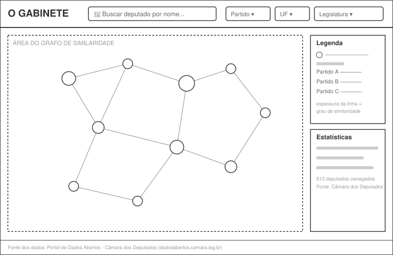
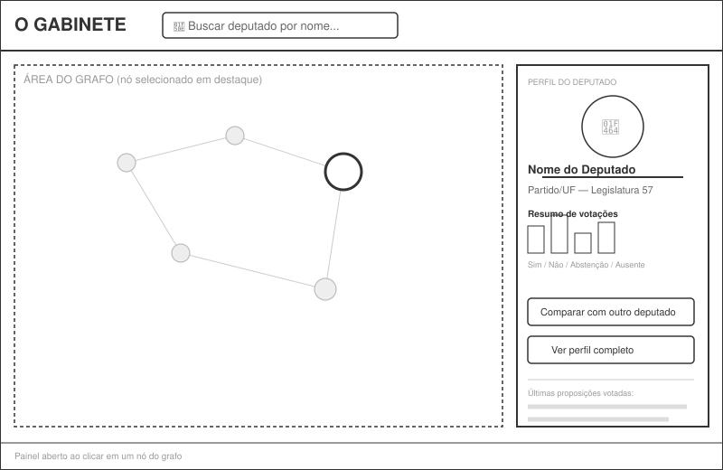
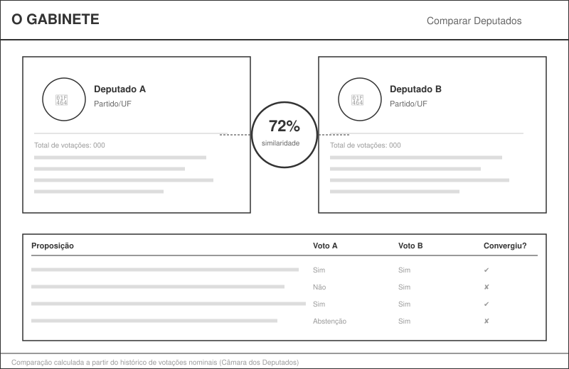
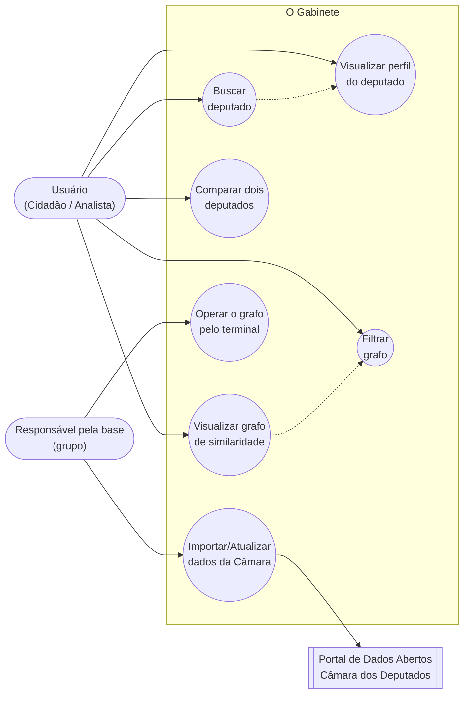
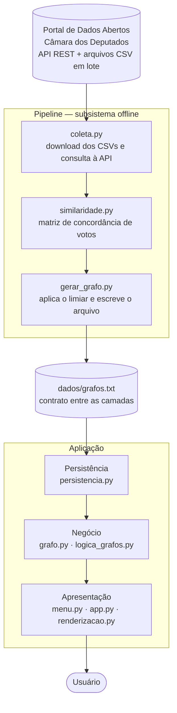

# O Gabinete — Mapa de Similaridade Política entre Deputados Federais

> **TG1 – Definição do Produto de Software**
> Laboratório de Engenharia de Software — Universidade Presbiteriana Mackenzie

---

## Capa

| | |
|---|---|
| **Universidade** | Universidade Presbiteriana Mackenzie — Faculdade de Computação e Informática |
| **Disciplinas** | Laboratório de Engenharia de Software (Turma 6º D) · Teoria dos Grafos (Turma 6º D) · Interação Humano-Computador (Turma 6º D) |
| **Professores** | Gustavo Moreira Calixto (Lab. de Engenharia de Software) · Ivan Carlos Alcântara de Oliveira (Teoria dos Grafos) · Profa. Elisângela Botelho Gracias (Interção Humano Computador) |
| **Projeto** | O Gabinete — Mapa de Similaridade Política entre Deputados Federais |
| **Grupo** | Caio Ariel Cardoso Saraiva (RA 10439611) · Isabela Hissa Pinto (RA 10441873) · Kaique Barros Paiva (RA 10441787) · Mateus Kage Moya (RA 10332608) |
| **Repositório** | [github.com/hissapinto/O_Gabinete](https://github.com/hissapinto/O_Gabinete) |
| **Entrega** | TG1 |

> **Composição por disciplina.** O enunciado de Teoria dos Grafos limita os grupos a três integrantes. Naquela disciplina o projeto é entregue por Caio Ariel Cardoso Saraiva, Isabela Hissa Pinto e Kaique Barros Paiva. No Laboratório de Engenharia de Software o grupo conta também com Mateus Kage Moya.

---

## Sumário

1. [Introdução](#capítulo-1--introdução)
2. [Definição da Demanda](#capítulo-2--definição-da-demanda)
   - 2.1 [O problema ou oportunidade percebida](#21-o-problema-ou-oportunidade-percebida)
   - 2.2 [A razão ou justificativa para esta demanda](#22-a-razão-ou-justificativa-para-esta-demanda)
   - 2.3 [Descrição sucinta do produto de software](#23-descrição-sucinta-do-produto-de-software)
   - 2.4 [Clientes, usuários e demais envolvidos](#24-clientes-usuários-e-demais-envolvidosimpactados)
   - 2.5 [Principais etapas para construir o produto](#25-principais-etapas-necessárias-para-construir-o-produto)
   - 2.6 [Principais critérios de qualidade](#26-principais-critérios-de-qualidade-para-o-produto)
3. [Requisitos](#capítulo-3--requisitos)
4. [Wireframes](#capítulo-4--wireframes)
5. [Modelagem Leve do Sistema (Casos de Uso)](#capítulo-5--modelagem-leve-do-sistema-casos-de-uso)
6. [Arquitetura do Sistema](#capítulo-6--arquitetura-do-sistema)

> **Nota de escopo:** o projeto foi originalmente proposto na disciplina de Teoria dos Grafos ("Mapa de Similaridade Política") e é aqui detalhado como produto de software do Laboratório de Engenharia de Software. A fonte de dados foi restringida **exclusivamente à Câmara dos Deputados** (não ao Senado Federal), consumindo o [Portal de Dados Abertos da Câmara](https://dadosabertos.camara.leg.br/swagger/api.html). Este documento é incremental e será expandido nas próximas entregas (TG2, TG3...).

---

## Capítulo 1 – Introdução

O presente documento constitui a primeira entrega (TG1) do grupo na disciplina de Laboratório de Engenharia de Software, cujo objetivo é definir, de forma inicial, o produto de software a ser desenvolvido ao longo do semestre.

O produto, batizado de **"O Gabinete"**, é uma aplicação que constrói e visualiza um **grafo de similaridade entre deputados federais brasileiros**, a partir de dados públicos de votações nominais disponibilizados pela Câmara dos Deputados. A proposta nasceu na disciplina de Teoria dos Grafos e é aqui detalhada sob a ótica da Engenharia de Software: levantamento de requisitos, casos de uso, protótipo de interface (wireframe) e arquitetura da solução.

Os capítulos seguintes serão incrementados a cada nova entrega do grupo, conforme o andamento do projeto.

---

## Capítulo 2 – Definição da Demanda

### 2.1 O problema ou oportunidade percebida

A Câmara dos Deputados disponibiliza um grande volume de dados públicos sobre a atuação de seus parlamentares — votações nominais, proposições, filiação partidária, entre outros — por meio do seu Portal de Dados Abertos. Entretanto, esses dados são disponibilizados de forma fragmentada (arquivos CSV separados por ano, endpoints distintos da API REST) e pouco intuitiva, o que dificulta que um cidadão comum identifique padrões de comportamento e similaridade entre diferentes deputados sem conhecimento técnico prévio.

### 2.2 A razão ou justificativa para esta demanda

Grafos são uma representação natural para esse problema: cada deputado pode ser modelado como um vértice, e o grau de similaridade de comportamento de voto entre dois deputados como uma aresta ponderada. O partido não entra no cálculo da similaridade — ele é representado visualmente pela cor do vértice, de modo que os deputados que votam fora da orientação da própria bancada apareçam deslocados no grafo, o que é justamente o padrão mais informativo.

Visualizar esse grafo permite identificar de forma intuitiva agrupamentos (blocos de votação, alianças informais, votos cruzados) que seriam difíceis de perceber apenas analisando planilhas. Isso está alinhado ao **ODS 16 (Paz, Justiça e Instituições Eficazes)**, ao promover maior acesso à informação e transparência sobre a atuação política.

### 2.3 Descrição sucinta do produto de software

"O Gabinete" é uma aplicação desenvolvida em Python que:

- importa periodicamente dados de deputados e de votações nominais da Câmara dos Deputados;
- calcula um índice de similaridade de comportamento de voto entre cada par de deputados;
- constrói um grafo não orientado ponderado (deputados = vértices, similaridade = arestas), persistido no arquivo `dados/grafos.txt`;
- oferece uma aplicação de terminal com menu de operações sobre o grafo (leitura, gravação, inserção, remoção, exibição e análise de conexidade);
- oferece, adicionalmente, uma interface web interativa para visualizar, buscar, filtrar e comparar deputados a partir desse grafo.

### 2.4 Clientes, usuários e demais envolvidos/impactados

| Papel | Descrição |
|---|---|
| **Cliente** | O grupo do projeto/disciplina, representando, de forma simulada, uma organização de fomento à transparência política (ex.: ONG de dados abertos, veículo de imprensa) interessada em disponibilizar a ferramenta ao público. |
| **Usuários** | Cidadãos interessados em política, jornalistas, pesquisadores, estudantes de ciências políticas e analistas de dados. |
| **Envolvidos indiretos (impactados)** | Deputados federais, cujos dados públicos de atuação parlamentar são exibidos e comparados pela ferramenta. |
| **Ator de suporte** | Portal de Dados Abertos da Câmara dos Deputados, fonte de todos os dados consumidos pelo sistema. |

### 2.5 Principais etapas necessárias para construir o produto

1. Levantamento e especificação de requisitos (este documento).
2. Prototipação de baixa fidelidade da interface (wireframes).
3. Investigação exploratória da fonte de dados (*spike*), para verificar o volume de votações nominais disponíveis antes de fixar a modelagem.
4. Construção do pipeline de ingestão (download e tratamento dos arquivos e endpoints da Câmara).
5. Implementação do motor de cálculo de similaridade e do gerador do arquivo `grafos.txt`.
6. Implementação da estrutura de grafo e dos algoritmos de análise.
7. Implementação da aplicação de terminal com o menu de operações.
8. Implementação da interface web de visualização, busca, filtro e comparação.
9. Testes com dados reais e validação com o grupo e com os professores.
10. Ajustes de desempenho e usabilidade a partir do feedback recebido.

### 2.6 Principais critérios de qualidade para o produto

Utilizando a categorização **FURPS+** como referência:

- **Usabilidade:** a interface deve ser compreensível por um usuário sem conhecimento técnico em grafos ou ciência de dados.
- **Desempenho:** a renderização do grafo e a aplicação de filtros devem ocorrer em tempo aceitável (poucos segundos), mesmo com centenas de deputados carregados.
- **Confiabilidade:** o sistema deve lidar com indisponibilidades temporárias do Portal de Dados Abertos sem perder os dados já importados anteriormente. O grafo é versionado no repositório, de modo que a aplicação permanece executável mesmo sem acesso à fonte.
- **Interface/Implementação:** o sistema deve consumir exclusivamente fontes oficiais da Câmara dos Deputados (API REST e arquivos em lote), sem uso de dados do Senado Federal.
- **Questões legais:** apenas dados públicos e abertos devem ser utilizados, respeitando os termos de uso do portal da Câmara.

---

## Capítulo 3 – Requisitos

A tabela abaixo compõe o **backlog inicial do produto**, com os requisitos ordenados por prioridade. Os requisitos serão refinados e movidos entre sprints nas próximas entregas.

| ID | Descrição | Tipo | Prioridade |
|---|---|---|---|
| RF01 | O sistema deve importar dados dos deputados federais em exercício a partir do Portal de Dados Abertos da Câmara. | RF | Alta |
| RF02 | O sistema deve importar dados de votações nominais dos deputados (arquivos `votacoes` e `votacoesVotos`). | RF | Alta |
| RF03 | O sistema deve calcular um índice de similaridade entre pares de deputados a partir do histórico de votos. | RF | Alta |
| RF04 | O sistema deve construir um grafo não orientado ponderado, em que cada vértice representa um deputado e cada aresta representa o grau de similaridade entre dois deputados. | RF | Alta |
| RF05 | O sistema deve persistir o grafo em arquivo texto e permitir carregá-lo novamente, preservando vértices, arestas e pesos. | RF | Alta |
| RF06 | O sistema deve oferecer uma aplicação de terminal com menu que permita ler, gravar, inserir e remover vértices e arestas, exibir o grafo e analisar sua conexidade. | RF | Alta |
| RF07 | O sistema deve permitir a visualização gráfica interativa do grafo de similaridade. | RF | Alta |
| RNF01 | A interface deve ser compreensível por um usuário sem conhecimento técnico em ciência de dados ou grafos. | RNF | Alta |
| RNF02 | O sistema deve consumir exclusivamente a API e os arquivos oficiais de Dados Abertos da Câmara dos Deputados (dadosabertos.camara.leg.br), sem uso de dados do Senado Federal. | RNF | Alta |
| RNF03 | A estrutura de grafo deve ser implementada pelo grupo como lista de adjacência, sem uso de biblioteca externa de grafos no núcleo da aplicação. | RNF | Alta |
| RF08 | O sistema deve permitir buscar um deputado específico por nome, partido ou UF. | RF | Média |
| RF09 | O sistema deve exibir informações detalhadas de um deputado (nome, partido, UF, foto, resumo de votos) ao selecioná-lo no grafo. | RF | Média |
| RF10 | O sistema deve permitir filtrar o grafo por partido, UF ou legislatura. | RF | Média |
| RNF04 | O sistema deve ser desenvolvido em Python 3. | RNF | Média |
| RNF05 | A renderização do grafo completo deve ocorrer em no máximo poucos segundos, mesmo com todos os deputados carregados. | RNF | Média |
| RNF06 | O sistema deve tratar indisponibilidades temporárias do portal de dados sem perda dos dados já importados. | RNF | Média |
| RF11 | O sistema deve permitir comparar dois deputados selecionados, exibindo o percentual de similaridade e os principais pontos de convergência e divergência de voto. | RF | Baixa |
| RF12 | O sistema deve identificar e destacar visualmente agrupamentos de deputados com comportamento semelhante. | RF | Baixa |
| RF13 | O sistema deve permitir atualizar periodicamente a base de dados de votações a partir da Câmara dos Deputados. | RF | Baixa |
| RNF07 | A interface web deve ser acessível via navegador, sem necessidade de instalação local pelo usuário final. | RNF | Baixa |
| RNF08 | O sistema deve utilizar apenas dados públicos e abertos, respeitando os termos de uso do portal da Câmara. | RNF | Baixa |

**Regras de negócio identificadas:**

- **RN01** — A similaridade entre dois deputados é calculada com base na proporção de votos coincidentes em proposições votadas por ambos.
- **RN02** — Deputados com histórico de votação abaixo de um mínimo definido (ex.: 10 votações registradas) não entram no cálculo de similaridade, para evitar distorções estatísticas.
- **RN03** — O peso de cada aresta do grafo representa o percentual de concordância de voto entre os dois deputados, expresso como inteiro de 0 a 100.
- **RN04** — A filiação partidária não influencia o peso da aresta. O partido é representado apenas como atributo visual do vértice, para que divergências em relação à própria bancada permaneçam visíveis.
- **RN05** — Somente votações nominais entram no cálculo, uma vez que votações simbólicas não registram o voto individual de cada parlamentar.

---

## Capítulo 4 – Wireframes

Protótipos de **baixa fidelidade** (estrutura e navegação, sem esquema de cores definitivo) das três telas principais do sistema.

### 4.1 Tela principal — Grafo de similaridade

Tela inicial: busca de deputados, filtros (partido, UF, legislatura), área central com o grafo interativo, painel de legenda e estatísticas.



### 4.2 Painel de perfil do deputado

Aberto ao clicar em um nó (deputado) do grafo: exibe foto, nome, partido/UF, resumo de votações e ações rápidas (comparar, ver perfil completo).



### 4.3 Tela de comparação entre dois deputados

Exibe os dois perfis lado a lado, o percentual de similaridade calculado e a lista de proposições em que os votos convergiram ou divergiram.



---

## Capítulo 5 – Modelagem Leve do Sistema (Casos de Uso)

### 5.1 Atores

- **Usuário (Cidadão/Analista)** — ator principal; busca visualizar e comparar deputados para entender padrões de comportamento político.
- **Responsável pela base (grupo/administrador)** — ator principal responsável por manter a base de dados atualizada.
- **Portal de Dados Abertos da Câmara dos Deputados** — ator de suporte; fornece os dados de deputados e votações consumidos pelo sistema.

### 5.2 Casos de uso (forma resumida)

| Caso de uso | Descrição resumida |
|---|---|
| **UC01 – Visualizar grafo de similaridade** | O usuário acessa a aplicação e visualiza o grafo com todos os deputados carregados, podendo navegar (zoom/pan) pela representação visual. |
| **UC02 – Buscar deputado** | O usuário digita um nome, partido ou UF na busca e o sistema destaca/centraliza o(s) deputado(s) correspondente(s) no grafo. |
| **UC03 – Visualizar perfil do deputado** | O usuário clica em um vértice do grafo e o sistema exibe um painel com as informações detalhadas daquele deputado. |
| **UC04 – Filtrar grafo** | O usuário aplica filtros (partido, UF, legislatura) e o sistema recalcula a exibição do grafo, mostrando apenas os deputados filtrados. |
| **UC05 – Comparar dois deputados** | O usuário seleciona dois deputados e o sistema exibe o percentual de similaridade e os pontos de convergência/divergência de voto entre eles. |
| **UC06 – Importar/Atualizar dados da Câmara** | O responsável pela base aciona a importação de dados atualizados de deputados e votações a partir do Portal de Dados Abertos da Câmara. |
| **UC07 – Operar o grafo pelo terminal** | O responsável pela base carrega o arquivo do grafo, insere ou remove vértices e arestas, consulta a estrutura e analisa a conexidade, gravando as alterações de volta no arquivo. |

### 5.3 Caso de uso completo — UC01: Visualizar grafo de similaridade

> Escolhido por ser o caso de uso mais crítico do sistema: é o ponto de entrada principal e a funcionalidade que sustenta o valor central do produto.

- **Ator principal:** Usuário (Cidadão/Analista)
- **Ator de suporte:** Portal de Dados Abertos da Câmara dos Deputados
- **Nível:** Objetivo do usuário
- **Pré-condições:** A base de dados de deputados e votações já foi importada e processada pelo pipeline (ver UC06); o arquivo `dados/grafos.txt` já foi gerado.
- **Garantia de sucesso (pós-condições):** O usuário visualiza, na tela principal, o grafo de similaridade com todos os deputados carregados, podendo interagir com ele (zoom, arraste, seleção de nós).

**Cenário de sucesso principal:**

1. O usuário acessa a aplicação "O Gabinete".
2. O sistema carrega o grafo a partir do arquivo `dados/grafos.txt`.
3. O sistema renderiza os deputados como vértices e as similaridades como arestas ponderadas (espessura proporcional ao grau de similaridade, cor do vértice indicando o partido).
4. O sistema exibe, junto ao grafo, um painel de legenda e estatísticas gerais (total de deputados carregados, fonte dos dados, período considerado).
5. O usuário navega livremente pelo grafo (zoom, arraste, destaque de vértices ao passar o mouse).

**Extensões (cenários alternativos):**

- **2a.** Se o arquivo do grafo não existir, o sistema informa que o pipeline de ingestão ainda não foi executado e orienta o responsável pela base.
- **3a.** Se o volume de arestas comprometer o desempenho da renderização, o sistema aplica um limiar mínimo de similaridade, reduzindo o número de arestas exibidas.
- **5a.** Se o usuário não interagir com o grafo, a tela permanece estática, exibindo o estado inicial completo.

**Requisitos especiais:** RF04, RF05, RF07, RNF01, RNF05.

**Frequência de uso:** Alta — é o caso de uso executado a cada acesso à aplicação.

### 5.4 Diagrama de caso de uso (UML)



---

## Capítulo 6 – Arquitetura do Sistema

### 6.1 Visão geral

A arquitetura segue o **padrão em camadas**, com uma decisão estruturante: o arquivo `dados/grafos.txt` funciona como **contrato explícito** entre o pipeline de ingestão e a aplicação. O pipeline é um subsistema executado offline, que produz um artefato; a aplicação consome esse artefato e não conhece a fonte de dados.

A decisão está registrada em [`docs/adr/0001-arquitetura-em-camadas.md`](docs/adr/0001-arquitetura-em-camadas.md).



### 6.2 Descrição das camadas

| Camada | Módulos | Responsabilidade |
|---|---|---|
| **Pipeline** (subsistema offline) | `pipeline/coleta.py`, `pipeline/similaridade.py`, `pipeline/gerar_grafo.py` | Baixar os CSVs, consultar a API de deputados, calcular a similaridade e gerar o arquivo do grafo. Único lugar onde `pandas` e `requests` são utilizados. |
| **Apresentação** | `src/apresentacao/menu.py`, `src/apresentacao/app.py`, `src/apresentacao/renderizacao.py` | Interação com o usuário, em duas formas: menu de terminal e interface web. |
| **Negócio** | `src/negocio/grafo.py`, `src/negocio/logica_grafos.py` | Estrutura do grafo (lista de adjacência) e algoritmos de análise, entre eles a conexidade. |
| **Persistência** | `src/persistencia/persistencia.py` | Leitura e gravação do arquivo `grafos.txt`, encapsulando o conhecimento do formato. |
| **Dados** | `dados/grafos.txt` | Armazenamento do grafo em formato texto, versionado no repositório. |

A dependência aponta sempre para baixo, e as camadas são fechadas: a apresentação não acessa a persistência diretamente. O ponto de entrada `src/main.py` não pertence a nenhuma camada — monta as peças e inicia a aplicação.

**Fonte externa de dados.** Portal de Dados Abertos da Câmara dos Deputados, combinando os arquivos em lote (`votacoesVotos-{ano}.csv`, `votacoes-{ano}.csv`) para o histórico de votações — um download por ano, em vez de uma requisição por votação — e a API REST (documentada em [dadosabertos.camara.leg.br/swagger/api.html](https://dadosabertos.camara.leg.br/swagger/api.html)) para obter partido e unidade federativa de cada deputado. A investigação exploratória inicial está preservada em [`docs/spikes/`](docs/spikes/).

**Consequência prática.** A aplicação de terminal não depende de rede, de `pandas` nem de bibliotecas externas de grafos: basta clonar o repositório e executar `python src/main.py`. Se o portal estiver indisponível no momento da demonstração, o comportamento não muda, pois o `grafos.txt` está versionado.

### 6.3 Estrutura de diretórios

```
O_Gabinete/
├── dados/
│   ├── brutos/                 CSVs baixados, não versionado
│   └── grafos.txt              camada de dados
├── docs/
│   ├── adr/                    registros de decisão
│   └── spikes/                 investigação descartável
├── pipeline/                   subsistema offline
│   ├── coleta.py
│   ├── similaridade.py
│   └── gerar_grafo.py
├── src/
│   ├── apresentacao/           camada de apresentação
│   │   ├── menu.py
│   │   ├── app.py
│   │   └── renderizacao.py
│   ├── negocio/                camada de negócio
│   │   ├── grafo.py
│   │   └── logica_grafos.py
│   ├── persistencia/           camada de persistência
│   │   └── persistencia.py
│   └── main.py                 ponto de entrada
├── tests/
├── README.md
└── requirements.txt
```

### 6.4 Tecnologias previstas

| Categoria | Tecnologia | Onde é usada |
|---|---|---|
| Linguagem | Python 3 | todo o projeto |
| Ingestão e tratamento de dados | `requests`, `pandas` | apenas no pipeline |
| Estrutura de grafo | implementação própria (lista de adjacência) | camada de negócio |
| Interface de terminal | biblioteca padrão | camada de apresentação |
| Interface web | Streamlit | camada de apresentação |
| Renderização do grafo | Pyvis (e NetworkX apenas para cálculo de coordenadas de layout) | camada de apresentação |
| Testes | pytest | `tests/` |
| Fonte de dados | Portal de Dados Abertos — Câmara dos Deputados | pipeline |
| Controle de versão | Git / GitHub | todo o projeto |

> **Decisão em aberto.** O uso de NetworkX restrito ao cálculo de coordenadas de desenho será confirmado com o professor de Teoria dos Grafos. Caso não seja aceito, a camada de apresentação passa a usar a simulação de física do próprio Pyvis, sem impacto nas demais camadas.